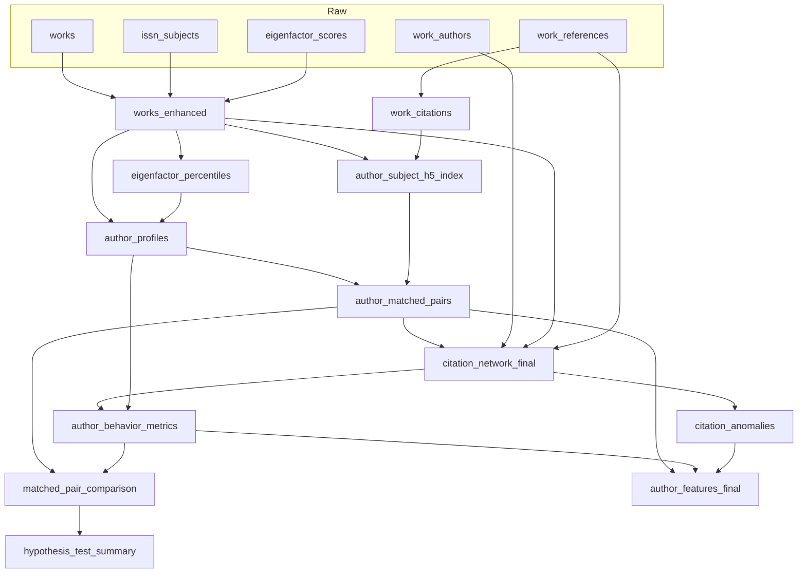

# Citation Manipulation SQL Pipeline

This README explains how the SQL pipeline builds all derived tables used by the analysis scripts under `final_indexes/citation_manipulation`. It documents the data lineage, execution order, key metrics (including `coauthor_citation_rate`), verification checks, and common pitfalls.

## Overview
- Purpose: derive per-author features and matched-pair comparisons to study citation manipulation signals.
- Engine: SQLite (tables created under the `rolap` schema prefix).
- Core inputs: `works`, `work_authors`, `work_references`, `issn_subjects`, `eigenfactor_scores`.
- Main outputs:
  - `rolap.works_enhanced`: works with subject + eigenfactor scores
  - `rolap.work_citations`: per-DOI citation counts
  - `rolap.eigenfactor_percentiles`: per-subject EF quartiles (p25, p75)
  - `rolap.author_subject_h5_index`: subject-specific h5 index per author
  - `rolap.author_profiles`: per-(author, subject) tier labels
  - `rolap.author_matched_pairs`: bottom-tier cases matched to top-tier controls
  - `rolap.citation_network_final`: author→author yearly citation edges with self/coauthor flags
  - `rolap.author_behavior_metrics`: per-(author, subject) cohesion metrics
  - `rolap.citation_anomalies`: per-author malice metrics from pairwise edges
  - `rolap.matched_pair_comparison`: case/control metrics aligned per pair
  - `rolap.hypothesis_test_summary`: aggregate differences across pairs
  - `rolap.author_features_final`: consolidated features per author and tier

### Pipeline DAG (Mermaid)



ASCII fallback:

```
works + issn_subjects + eigenfactor_scores -> works_enhanced -> eigenfactor_percentiles -> author_profiles -> author_matched_pairs
work_references -> work_citations -> author_subject_h5_index ----^
author_matched_pairs + work_authors + works_enhanced + work_references -> citation_network_final -> author_behavior_metrics
                                                               \-> citation_anomalies
author_matched_pairs + author_behavior_metrics -> matched_pair_comparison -> hypothesis_test_summary
author_matched_pairs + author_behavior_metrics + citation_anomalies -> author_features_final
```

## Execution Order (DAG)
1. `00_prepare_base_tables.sql` — add base indexes on raw tables
2. `works_enhanced.sql` — enrich works with subject and eigenfactor
3. `work_citations.sql` — count citations per DOI
4. `eigenfactor_percentiles.sql` — compute subject EF quartiles
5. `author_subject_h5_index.sql` — compute h5 per (author, subject)
6. `author_profiles.sql` — classify authors into tiers per subject
7. `author_matched_pairs.sql` — match Bottom vs Top tier authors within subject
8. `citation_network_final.sql` — build author→author citation edges + coauthor flags
9. `author_behavior_metrics.sql` — aggregate per-author cohesion metrics (subject join)
10. `citation_anomalies.sql` — compute reciprocity/asymmetry and velocity/bursts
11. `matched_pair_comparison.sql` — join behavior metrics onto matched pairs
12. `hypothesis_test_summary.sql` — summarize differences
13. `author_features_final.sql` — final per-author feature table

## Workflow Logic
- Goal: compare authors likely engaging in problematic citation behavior (Bottom Tier cases) with comparable high-performing peers (Top Tier controls) within the same subject, using objective metrics and rigorous pairing.
- Strategy: build reliable subject-aware author descriptors, then produce matched pairs that control for field and productivity (via h5-index), and finally extract behavior signals from the citation network.
- Subject grounding: all core features are keyed by `(orcid, subject)` to avoid cross-field leakage. `author_profiles` sets the authoritative subject assignment per author for downstream behavior metrics.
- Cohesion vs malice: we distinguish benign cohesion (e.g., coauthor citation rate) from potentially manipulative patterns (asymmetry, bursts/velocity). Both are needed to contextualize behavior.
- Pairwise design: `author_matched_pairs` balances cases/controls by subject and binned h5-index. `matched_pair_comparison` materializes side-by-side metrics to support robust, paired tests.
- Missing data policy: rates with zero denominators are left NULL at source and later `COALESCE(..., 0)` when used in comparisons to prevent systemic drops while preserving signal sparsity.
- Performance: all heavy steps are pre-indexed and staged; large joins run on indexed keys, and the EF computation is precomputed and stored to avoid repeated costly scoring.
- Downstream analysis: `author_features_final` serves ML and visualization, unifying coauthor rate, self-citation rate, and anomalies with a stable tier label for each subject.

## Key Tables and Metrics

### `rolap.works_enhanced`
- Columns: `work_id`, `doi`, `published_year`, `issn`, `subject`, `eigenfactor_score`.
- Built from `works` + `issn_subjects` + `eigenfactor_scores`.

### `rolap.work_citations`
- Columns: `doi`, `citations_number`.
- Built from `work_references`.

### `rolap.eigenfactor_percentiles`
- Columns: `subject`, `p25`, `p75` — per-subject quartiles for EF score.

### `rolap.author_subject_h5_index`
- Columns: `orcid`, `subject`, `h5_index` — subject-specific h-index based on paper-level citations.

### `rolap.author_profiles`
- Columns: `orcid`, `subject`, `papers_in_subject`, `avg_eigenfactor`, `author_tier`.
- Tier rules (requires ≥3 papers in subject):
  - Bottom Tier: bottom-quartile share ≥ 0.7
  - Top Tier: top-quartile share ≥ 0.7
  - Mixed Tier: otherwise
  - Insufficient Data: < 3 papers

### `rolap.author_matched_pairs`
- Columns: `case_orcid`, `control_orcid`, `subject`.
- Bottom-Tier authors are sampled per subject and matched to Top-Tier controls by binned `h5_index` proximity.

### `rolap.citation_network_final`
- Columns: `citing_orcid`, `cited_orcid`, `citation_year`, `citation_count`, `is_self_citation`, `is_coauthor_citation`.
- Coauthor status derives from coauthorship edges where first collaboration year ≤ citation year.

### `rolap.author_behavior_metrics`
- Purpose: cohesion metrics per author, aligned to their primary subject.
- Built from `citation_network_final` aggregated by `citing_orcid` and joined to `author_profiles` for subject.
- Columns:
  - `orcid`
  - `subject` (from `author_profiles`)
  - `total_outgoing_citations`
  - `self_citation_rate = self_citations / total_outgoing_citations`
  - `coauthor_citation_rate = coauthor_citations_non_self / total_outgoing_citations_non_self`
- Notes:
  - Self-citations are excluded from the coauthor rate denominator.
  - Authors without outgoing non-self citations yield NULL; downstream joins typically `COALESCE(..., 0)`.

### `rolap.citation_anomalies`
- Aggregates pairwise metrics per citing author:
  - `avg_asymmetry`, `max_asymmetry`, `avg_velocity`, `max_burst`.

### `rolap.matched_pair_comparison`
- Columns: `case_orcid`, `control_orcid`, `subject`, `case_*`, `control_*` for citations and rates.
- Joins `author_behavior_metrics` twice (case/control) on `(orcid, subject)`.

### `rolap.hypothesis_test_summary`
- High-level aggregate differences across all pairs.

### `rolap.author_features_final`
- Consolidated per-author features with tier label and subject for ML.
- Columns: `orcid`, `tier_type`, `subject`, `coauthor_citation_rate`, `avg_asymmetry`, `max_asymmetry`, `avg_velocity`, `max_burst`, `self_citation_rate`.

## Verification & Sanity Checks
- Row counts present:
  - `SELECT COUNT(*) FROM rolap.works_enhanced;`
  - `SELECT COUNT(*) FROM rolap.author_subject_h5_index;`
  - `SELECT COUNT(*) FROM rolap.author_profiles;`
  - `SELECT COUNT(*) FROM rolap.author_matched_pairs;`
  - `SELECT COUNT(*) FROM rolap.citation_network_final;`
  - `SELECT COUNT(*) FROM rolap.author_behavior_metrics;`
- Coauthor rate coverage:
  - `SELECT COUNT(*) FROM rolap.author_behavior_metrics WHERE coauthor_citation_rate IS NOT NULL;`
  - Expect some NULLs when `total_outgoing_citations_non_self = 0`.
- Denominator zero guard:
  - `SELECT COUNT(*) FROM rolap.author_behavior_metrics WHERE total_outgoing_citations_non_self = 0;`
- Pairwise completeness:
  - `SELECT COUNT(*) FROM rolap.matched_pair_comparison WHERE case_coauthor_citation_rate IS NOT NULL AND control_coauthor_citation_rate IS NOT NULL;`
- Spot check a few authors:
  - Compare direct aggregates to `citation_network_final` for a known `orcid`.

## Troubleshooting & Pitfalls
- Missing subjects: `author_profiles` determines the subject used in behavior metrics; if profiles are empty or an orcid lacks a subject, the join yields no row, and later joins may `COALESCE` to 0.
- Multiple subjects per author: `author_profiles` creates one row per (orcid, subject); ensure downstream joins use both keys where subject is relevant.
- Coauthor rate NULLs: Expected when an author has no non-self outgoing citations; downstream safely `COALESCE(..., 0)` when comparing pairs.
- Indexing: Ensure creation of indexes in `00_prepare_base_tables.sql`, and the additional indexes defined within each script, to keep performance acceptable on large datasets.
- Reproducibility: `author_matched_pairs.sql` uses deterministic tie-breakers to keep matches stable.

## Downstream Usage
- `citation_analysis.py` consumes:
  - `rolap.matched_pair_comparison` for pairwise case/control comparisons
  - `rolap.citation_anomalies` and `rolap.author_behavior_metrics` to assemble per-author features
- Expectation: joins on `(orcid, subject)` for behavior metrics; pairwise fields are already prefixed as `case_`/`control_` in `matched_pair_comparison`.

## Detailed Table Creation

This section documents, for each table, the exact inputs, indexes, steps/CTEs, logic and edge cases. Read side-by-side with the corresponding `.sql` file.

### 1) `00_prepare_base_tables.sql`
- Inputs: `works`, `work_authors`, `work_references`, `issn_subjects`, `eigenfactor_scores`.
- Actions: Adds targeted indexes to accelerate all downstream joins and window functions.
- Notes: Pure indexing; no tables created. Returns `SELECT 1` for quick smoke-check.
 - Method: Index creation only (`CREATE INDEX IF NOT EXISTS ...`).

### 2) `rolap.works_enhanced`
- Inputs: `works`, `issn_subjects`, `eigenfactor_scores`.
- Columns: `work_id`, `doi`, `published_year`, `issn`, `subject`, `eigenfactor_score`.
- Logic: Left-join subjects by ISSN, then eigenfactor score by `(issn, subject)`. Filters to non-null DOIs and present years.
- Edge cases: If EF score missing, uses `COALESCE(..., 0)`; `subject` may be null if ISSN not mapped.
 - Method: Single SELECT with LEFT JOINs materialized via `CREATE TABLE ... AS SELECT`.

### 3) `rolap.work_citations`
- Inputs: `work_references` with index on `doi`.
- Columns: `doi`, `citations_number`.
- Logic: Aggregate count of rows by `doi` excluding null DOIs.
- Edge cases: Cited DOIs absent from `works` are still counted; this is intentional for citation counts.
 - Method: `CREATE TABLE ... AS SELECT doi, COUNT(*) ... GROUP BY doi`.

### 4) `rolap.eigenfactor_percentiles`
- Inputs: `rolap.works_enhanced`.
- Columns: `subject`, `p25`, `p75`.
- Logic: For each subject, rank EF scores, compute quartile cutoffs via RN and total count; require `n_works >= 50`.
- Edge cases: Subjects with sparse data are excluded; downstream classification will then see fewer tiered authors.
 - Method: Window functions (`ROW_NUMBER()`, `COUNT() OVER`) and grouped aggregation; materialized via `CREATE TABLE ... AS SELECT`.

### 5) `rolap.author_subject_h5_index`
- Inputs: `work_authors`, `rolap.works_enhanced`, `rolap.work_citations`.
- Columns: `orcid`, `subject`, `h5_index`.
- Logic:
  1. Join each author to their works and subjects; attach per-DOI citation counts.
  2. Rank an author's papers within each subject by citations (desc).
  3. Define h5-index per subject as the max rank where `paper_rank <= citations`.
- Edge cases: Authors lacking citations can still have `h5_index = 0`. Requires non-null `(orcid, subject)`.
 - Method: Multi-CTE pipeline (join, window `ROW_NUMBER()`, filter, aggregate) -> `CREATE TABLE ... AS SELECT`.

### 6) `rolap.author_profiles`
- Inputs: `work_authors`, `rolap.works_enhanced`, `rolap.eigenfactor_percentiles`.
- Columns: `orcid`, `subject`, `papers_in_subject`, `avg_eigenfactor`, `author_tier`.
- Logic:
  1. Precompute `(orcid, subject, eigenfactor_score)` from works.
  2. Join percentiles by subject; aggregate counts and quartile shares per `(orcid, subject)`.
  3. Classify `author_tier` using rules (>=3 papers): Bottom if bottom-quartile share ≥ 0.7; Top if top-quartile share ≥ 0.7; else Mixed; otherwise Insufficient Data.
- Edge cases: An author may have multiple subjects (one row per subject). Index `rolap.idx_ep_subject` ensures fast join.
 - Method: CTEs to precompute paper stats, join to percentiles, then CASE-based tiering -> `CREATE TABLE ... AS SELECT`.

### 7) `rolap.author_matched_pairs`
- Inputs: `rolap.author_profiles`, `rolap.author_subject_h5_index`.
- Columns: `case_orcid`, `control_orcid`, `subject`.
- Logic:
  1. Enrich authors with their subject h5-index and keep only Bottom/Top tiers with `h5_index > 0`.
  2. Sample up to 2000 Bottom-Tier case authors per subject using deterministic pseudo-random ordering.
  3. Bucket h5-index into `h5_bucket = floor(h5_index/3)` for both cases and full Top-Tier controls.
  4. Join on subject and adjacent buckets to find close controls; rank by absolute h5 diff, then deterministic tiebreaker.
  5. Keep `match_rank = 1` per case author.
- Edge cases: If no control within adjacent buckets, a case may be unmatched and thus excluded.
 - Method: Multi-CTE pipeline using window `ROW_NUMBER()` for sampling and ranking; equality join on `(subject, h5_bucket)`; final `WHERE match_rank = 1`.

### 8) `rolap.citation_network_final`
- Inputs: `rolap.author_matched_pairs`, `work_authors`, `rolap.works_enhanced`, `work_references`, `works`.
- Columns: `citing_orcid`, `cited_orcid`, `citation_year`, `citation_count`, `is_self_citation`, `is_coauthor_citation`.
- Logic:
  1. Identify all matched authors (both case and control) to scope computation.
  2. Build `relevant_works`: all (work_id, orcid, doi, year, subject) for matched authors.
  3. Build coauthor edges: for each coauthored paper, record pair and first collaboration year.
  4. Build base citation edges by joining `work_references` to map from citing work to cited DOI's work, then to authors; group by `(citing_orcid, cited_orcid, year)`.
  5. Flag self-citations where `citing_orcid = cited_orcid`.
  6. Flag coauthor citations when a prior collaboration exists with `first_collaboration_year <= citation_year`.
- Edge cases: Subject equality between citing/cited is intentionally not enforced to avoid dropping cross-subject edges.
 - Method: CTEs to scope authors and works, build coauthor links, then aggregate citation edges; final join to flag coauthor citations; materialized via `CREATE TABLE ... AS SELECT`.

### 9) `rolap.author_behavior_metrics`
- Inputs: `rolap.citation_network_final` (aggregated by `citing_orcid`), joined to `rolap.author_profiles` for subject.
- Columns: `orcid`, `subject`, `total_outgoing_citations`, `self_citation_rate`, `coauthor_citation_rate`.
- Logic:
  1. Aggregate raw per-author totals: total outgoing, self-citations, coauthor non-self citations, total outgoing non-self.
  2. Join `(orcid)` to profiles to attach the author's primary subject used downstream.
  3. Compute rates:
     - `self_citation_rate = self_citations / total_outgoing_citations`
     - `coauthor_citation_rate = coauthor_citations_non_self / NULLIF(total_outgoing_citations_non_self, 0)`
- Edge cases:
 - Method: CTE aggregate over edges then join to profiles; compute rates inline; `CREATE TABLE ... AS SELECT`.
  - Authors with no non-self outgoing citations have NULL `coauthor_citation_rate` (denominator guard); downstream comparisons typically `COALESCE(..., 0)`.
  - If an author is absent from `author_profiles`, no row appears here; ensure profiles are populated first.

### 10) `rolap.citation_anomalies`
- Inputs: `rolap.citation_network_final`.
- Columns: per citing author: `avg_asymmetry`, `max_asymmetry`, `avg_velocity`, `max_burst`.
- Logic:
  1. Aggregate total citations per ordered pair and compute reciprocal counts.
  2. Compute yearly counts and lag to detect bursts.
  3. Derive per-pair metrics: reciprocity ratio, asymmetry score, velocity, max burst.
  4. Aggregate per citing author to averages and maxima.
- Edge cases: Pairs with zero denominators are protected via NULLIF; yearly gaps handled with lag default 0.
 - Method: Multi-CTE: aggregate pairs, reciprocal join, yearly window with `LAG`, then author-level aggregation -> `CREATE TABLE ... AS SELECT`.

### 11) `rolap.matched_pair_comparison`
- Inputs: `rolap.author_matched_pairs`, `rolap.author_behavior_metrics` (joined twice by `(orcid, subject)`).
- Columns: `case_orcid`, `control_orcid`, `subject`, plus `case_*` and `control_*` metrics.
- Logic: For each matched pair and subject, attach case/control total citations, self-citation rate, and coauthor citation rate.
- Edge cases: Behavior metrics may be missing for one side; the SQL uses `COALESCE(..., 0)` when projecting into this table.
 - Method: Straightforward SELECT with two LEFT JOINs to the same table, projecting prefixed fields.

### 12) `rolap.hypothesis_test_summary`
- Inputs: `rolap.matched_pair_comparison`.
- Columns: aggregate differences and proportions across all pairs.
- Logic: Compute mean differences and proportions where case > control for self/ coauthor rates.
 - Method: Single SELECT aggregation over pairwise projections -> `CREATE TABLE ... AS SELECT`.

### 13) `rolap.author_features_final`
- Inputs: `rolap.matched_pair_comparison`, `rolap.author_behavior_metrics`, `rolap.citation_anomalies`.
- Columns: one row per author with `tier_type`, `subject`, and consolidated features including `coauthor_citation_rate`, `avg/max_asymmetry`, `avg_velocity`, `max_burst`, `self_citation_rate`.
- Logic: Build all authors from pairs (case/control with tier label) then left-join behavior and anomaly metrics; fill missing with 0 for robust ML ingestion.
- Edge cases: If a feature is missing (e.g., absent in upstream), COALESCE ensures zeros to avoid null-driven drops downstream.
 - Method: UNION authors from pairs with tier labels, then LEFT JOIN to behavior and anomalies; project with `COALESCE`.

## Eigenfactor Calculation (`eigenfactor.py`)

The `eigenfactor_scores` used in `works_enhanced.sql` are produced by `final_indexes/citation_manipulation/eigenfactor.py`. This script computes subject-specific journal influence scores using a PageRank-like algorithm with article-weighted teleportation and proper handling of dangling journals.

- Inputs:
  - `get_citation_network.txt`: pipe-delimited `(citing_issn|cited_issn|subject|citation_count)`
  - `journal_articles.txt`: pipe-delimited `(issn|article_count)`

- Core model (per subject):
  - Build sparse citation matrix `Z` (rows=citing ISSN, cols=cited ISSN); zero the diagonal to remove self-cites.
  - Work with `H = Z^T` and normalize columns to be stochastic; identify dangling columns (no outgoing).
  - Article vector `a` = journal articles per subject normalized to 1; uniform fallback if missing.
  - Iteration: π_new = α·H·π + (α·dangling_sum + (1−α))·a, with α=0.85, until L1 convergence < 1e-6 or 1000 iters.
  - Eigenfactor score = (H·π) normalized to sum to 100.

- Implementation details:
  - Uses SciPy sparse matrices (`csr_matrix`, `diags`) and vectorized operations for speed.
  - Processes subjects in parallel (`multiprocessing.Pool`) with a cap on workers; supports batch processing for very large subject sets.
  - Emits `eigenfactor_scores_optimized.csv` and writes to SQLite table `eigenfactor_scores(issn, subject, eigenfactor_score)`.

- Pipeline integration:
  - `works_enhanced.sql` joins `eigenfactor_scores` on `(issn, subject)` to assign each work a subject EF score, which then feeds percentiles and author tiering.

- Notes and edge cases:
  - Journals with no outgoing citations are treated via the `dangling_sum` term; influence flows through article-weighted teleportation.
  - If no article data for a subject, the script falls back to a uniform article vector and logs a warning.
  - Self-citations are removed before normalization.

---

# Python Analysis: `citation_analysis.py`

This section explains, in depth, the goals, philosophy, data flow, methods, and outputs of the main Python analysis script `final_indexes/citation_manipulation/citation_analysis.py`. The script stitches together matched-pair statistics, unsupervised modeling, and network forensics to surface questionable citation practices while minimizing false positives.

## Why This Script Exists
- Purpose: provide a rigorous, end-to-end analysis of citation behaviors between matched Bottom-Tier “Case” authors and Top-Tier “Control” peers within the same subject.
- Motivation: detect patterns consistent with manipulation (e.g., asymmetric gifting, coordinated bursts, dense cartels) while separating benign cohesion (legitimate collaboration, subfield communities) from malice.
- Philosophy: presumption of innocence, field-aware comparisons, robust nonparametric testing, and conservative outlier detection that flags “areas to investigate,” not verdicts.

## Design Principles
- Balanced by construction: build the ML/outlier dataset from both sides of the matched pairs so Case/Control counts are equal and comparable.
- Subject-aware everywhere: features are keyed on `(orcid, subject)` to avoid cross-field leakage; scaling and outlier modeling adapt per subject.
- Cohesion vs malice: treat cohesion features as context, malice features as red flags. Elevation in malice absent cohesion is more suspicious than cohesion alone.
- Pairwise statistics first: paired tests control for unobserved heterogeneity by subject/productivity; effect sizes accompany p-values.
- Transparent availability: every metric reports how many complete pairs are in-scope; missingness never silently drives results.
- Conservative anomalies: isolation-based outliers use adaptive contamination (target ~100 outliers across large cohorts; bounded 0.5–5%).

## Data Inputs and Construction
- SQLite database: `rolap.db` (same DB used by the SQL pipeline).
- Consumed tables:
  - `rolap.matched_pair_comparison`: pre-aligned per-pair metrics with `case_*` and `control_*` columns.
  - `rolap.citation_network_final`: directed author→author citation edges with years and self/coauthor flags.
  - `rolap.author_behavior_metrics`: per-(author, subject) cohesion metrics (e.g., `coauthor_citation_rate`).
  - `rolap.citation_anomalies`: author-level malice features aggregated from pairwise edges (e.g., `max_asymmetry`, `avg_velocity`).

### Master Feature Table
The script builds a unified per-(orcid, subject) feature frame by merging unique authors from pairs with behavior and anomaly tables, then adds network-structural features computed on the citation graph:
- Structural features (computed from `citation_network_final`):
  - `clustering`: undirected clustering coefficient (cohesion proxy).
  - `triangles`: undirected triangle count (clique participation).
  - `in_strength`, `out_strength`: weighted in/out degree on the directed graph.
  - `give_take_ratio = out_strength / in_strength`: propensity to cite others far more than being cited back.
  - `avg_neighbor_degree`: cohesion proxy; dense neighborhoods imply communities.
  - `k_core_number`: coreness in the undirected backbone.
  - `pagerank`: authority/importance on the directed graph.
  - `clique_strength = clustering * coauthor_citation_rate`: interaction term for cohesive reciprocity.
- Missing data policy: structural metrics absent for an author default to 0. Behavior rates with undefined denominators remain NULL upstream and are `fillna(0.0)` downstream when constructing pairwise comparisons for fairness.

## Statistical Core (Per Subject and Overall)
For each scope (`OVERALL` and per subject), the script constructs an analysis table by joining pair rows with the master feature table on both sides of a pair and on `subject`. It then:
- Prints an availability report per metric: complete pair counts for each tested metric.
- Runs paired Wilcoxon signed-rank tests (alternative=greater, Case > Control) for:
  - `avg_asymmetry`, `max_asymmetry`, `avg_velocity`, `max_burst` (malice)
  - `coauthor_citation_rate`, `clustering`, `triangles` (cohesion)
- Reports three complementary effect sizes for interpretability:
  - Paired Probability of Superiority (paired CLES)
  - Cliff’s delta (nonparametric magnitude)
  - Cohen’s d for paired samples (parametric magnitude)
- Visualizes distributions (Figure 1): violins with box overlays, trimmed to robust quantiles to suppress extreme tails.
- Profiles the “hyper-active fringe”: top 1% of pairs by positive Case–Control difference on `clustering` to spotlight striking examples.

Rationale: the paired design conditions on subject and productivity (via the matching pipeline), reducing confounding. Nonparametric testing and effect sizes provide robust, distribution-light evidence.

## Unsupervised Modeling and Outlier Detection

### Balanced ML Dataset
The script builds a balanced author-level dataset by duplicating pair context into two rows: one for the `case_orcid` labeled `Case`, and one for the `control_orcid` labeled `Control`. This guarantees equal representation and preserves subject alignment.

### Behavioral Archetypes (K-Means)
- Features: a refined set emphasizing both cohesion and malice: `coauthor_citation_rate`, `clustering`, `triangles`, `max_asymmetry`, `avg_velocity`, `k_core_number`, `pagerank`, `clique_strength`, `give_take_ratio`.
- Scaling: per-subject standardization mitigates subject-level scale differences; fallback to global scaling if no subject.
- Clustering: `k=4` with `n_init=10` for stability; clusters are heuristically named:
  - Cohesive Collaborator (high clique_strength)
  - Asymmetric Gifter (high max_asymmetry without cohesion)
  - Solo Promoter (high self_citation_rate even if not in ML features)
  - Independent Researcher (none of the above dominant)
- Output: heatmap of archetype prevalence by tier (Figure `figure4_behavioral_archetypes.png`).

Why: archetypes summarize “normal” behavioral modes without supervision, providing context before anomaly hunting.

### Anomalous Outliers (Isolation Forest)
- Features: same refined set; robust scaling with `RobustScaler`.
- Contamination: adaptive per subject `cont = min(0.05, max(0.005, 100 / max(n, 1_000)))` to target ~100 outliers overall, with bounds 0.5–5%.
- Outputs: outlier flags, tier contingency table, and chi-square test for association between tier and anomaly frequency.
- Sensitivity: a stability report varies contamination across {0.5%, 1%, 2%, 5%} and prints outlier totals and Case share.

Why: isolation-based methods focus on point-wise rarity across many features, a good fit for “unusual” citation patterns.

### Outlier Fingerprints
`analyze_outlier_characteristics` compares means between outliers and normals across the ML features, reports fold changes, subject distribution of outliers, and drives a radar chart (Figure `figure_radar_fingerprint.png`) that visualizes which features most distinguish outliers.

## Network Forensics: Cartels and Syndicates
- Build a directed citation graph from `citation_network_final` and analyze the outlier-induced subgraph.
- Connected components among outliers (undirected view) are candidate “cartels.”
- Largest syndicate deep dive:
  - Composition by subject; leader by betweenness centrality.
  - Formation timeline and growth style (sudden bursts vs gradual).
  - Visualization of the largest syndicate (Figure `figure5_largest_cartel.png`).
- Archipelago view: disconnected components laid out on a grid, colored by subject (Figure `figure_archipelago.png`).
- Topology statistics: bootstrap confidence intervals for cartel-size descriptors.
- UMAP projection: enhanced 2D embedding with outliers highlighted and intra-cartel link overlays; side panel shows subject separation (Figure `figure6_enhanced_umap.png`).

Why: if manipulation is coordinated, we expect unusually dense, internally citing groups with synchronized activity and minimal external integration.

## Temporal Pattern Mining
Using an author×year matrix of outgoing citations, the script fits a 5-component Non-Negative Matrix Factorization (NMF) to uncover shared temporal signatures:
- Components (`H`) characterize relative activity shapes over time.
- Author weights (`W`) indicate which pattern each author follows most strongly; we count outliers aligned to each pattern.
- Outputs: pattern plots with outlier counts and aggregate outlier affinity (Figure `figure6_temporal_patterns_nmf.png`).

Why: manipulative campaigns often have distinctive temporal bursts or orchestrated waves; NMF provides interpretable patterns.

## Outputs and File Naming
Under `analysis_results/` (configurable), the script saves:
- `figure1_distributions_OVERALL.png` and per-subject `figure1_distributions_{subject}.png`.
- `figure2_temporal_trends_{scope}.png` (if yearly inputs are present for the scope).
- `figure3_community_properties.png` (community composition vs base rate).
- `figure4_behavioral_archetypes.png` and `figure_definitive_analysis.png` (two-panel dashboard).
- `figure_radar_fingerprint.png` (outlier fingerprint).
- `figure5_largest_cartel.png`, `figure_archipelago.png`, `figure_syndicate_timeline.png`.
- `figure6_enhanced_umap.png`, `figure6_temporal_patterns_nmf.png`.
- Console logs include availability reports, test summaries, crosstabs, chi-squared p-values, and sensitivity results.

Note: Some figures are conditional and only render when prerequisites exist (e.g., enough outliers, non-trivial components).

## Configuration
- Edit constants at the top of `citation_analysis.py`:
  - `DB_PATH`: path to the SQLite database (default `rolap.db`).
  - `BASE_OUTPUT_DIR`: output directory (default `analysis_results`).
  - `STUDY_YEARS`: years to consider for temporal summaries.
  - `OUTLIER_CONTAMINATION`: default contamination if not adapting per subject.

## Quickstart
- Environment (Linux/bash):
```bash
python -m venv .venv
source .venv/bin/activate
pip install pandas numpy networkx seaborn matplotlib scikit-learn statsmodels umap-learn powerlaw tqdm
# Ensure rolap.db is present in the working directory or update DB_PATH in the script
python final_indexes/citation_manipulation/citation_analysis.py
```
- Results: check `analysis_results/` for generated figures and the console for statistical summaries.

## Interpretation and Ethics
- Evidence, not verdicts: Outlier flags and community detections are investigative leads. Manual review is essential before drawing conclusions about intent.
- Context matters: High cohesion within elite, tight-knit subfields can be normal. Suspicion rises when malice metrics spike without proportional cohesion.
- Stability checks: We report effect sizes alongside p-values and run sensitivity analyses to ensure findings are not parameter artifacts.
- Subject fairness: Per-subject scaling and adaptive contamination mitigate bias arising from heterogeneous subject norms.

## Limitations and Extensions
- Yearly aggregates: If yearly case/control metrics are unavailable in the DB, temporal trend plots may be sparse; consider adding yearly versions of behavior metrics to SQL.
- Package availability: UMAP and power-law diagnostics require optional packages; the script degrades gracefully if missing but skips related figures.
- Feature additions: To add metrics, compute them per author (and subject when applicable), merge into the master table, add to `ML_FEATURE_SET`, and include in availability/tests if appropriate.
- Reproducibility: Ensure the matched-pair SQL remains deterministic; pipeline changes can shift sample composition.

## Glossary of Key Metrics
- `coauthor_citation_rate`: fraction of non-self outgoing citations that target prior coauthors (cohesion proxy).
- `self_citation_rate`: fraction of outgoing citations that are self-citations.
- `avg_velocity`/`max_burst`: speed and maximum sudden increases in pairwise citation flows.
- `avg_asymmetry`/`max_asymmetry`: imbalance in reciprocal citation flows.
- `clustering`/`triangles`: undirected local cohesion and clique participation.
- `k_core_number`: minimum degree to remain in k-core; structural embeddedness.
- `pagerank`: influence via incoming citations; authority in the directed network.
- `give_take_ratio`: propensity to cite vs being cited; excessive giving without returns can indicate gifting.
- `clique_strength`: interaction of cohesion and coauthoring; legit collaboration tends to raise both.
